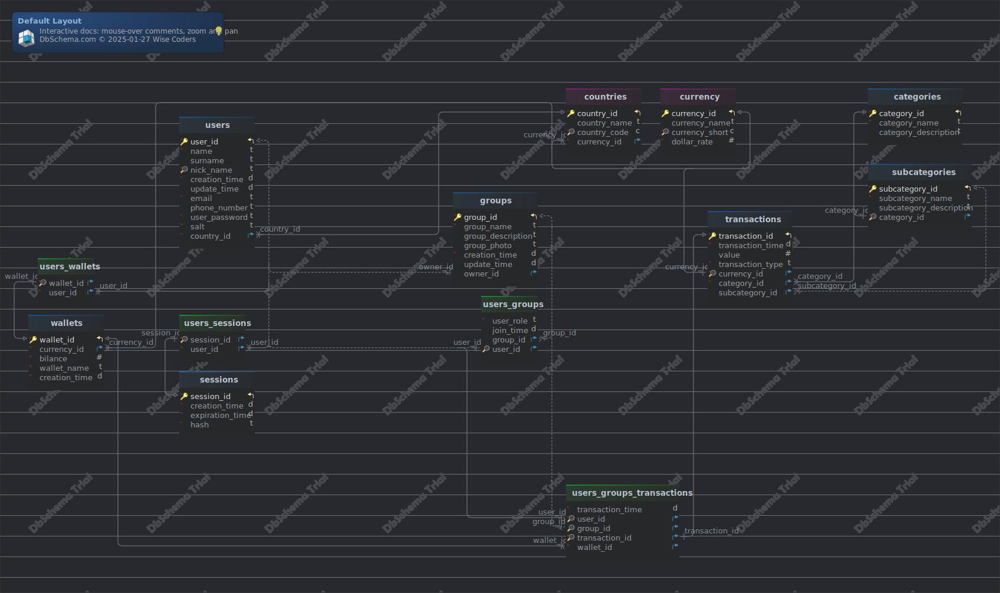

#Default Layout
Generated using [DbSchema](https://dbschema.com)


### Default Layout



## Tables

1. [home budget application.categories](#table%20home%20budget%20application.categories) 
2. [home budget application.countries](#table%20home%20budget%20application.countries) 
3. [home budget application.currency](#table%20home%20budget%20application.currency) 
4. [home budget application.groups](#table%20home%20budget%20application.groups) 
5. [home budget application.sessions](#table%20home%20budget%20application.sessions) 
6. [home budget application.subcategories](#table%20home%20budget%20application.subcategories) 
7. [home budget application.transactions](#table%20home%20budget%20application.transactions) 
8. [home budget application.users](#table%20home%20budget%20application.users) 
9. [home budget application.users_groups](#table%20home%20budget%20application.users\_groups) 
10. [home budget application.users_groups_transactions](#table%20home%20budget%20application.users\_groups\_transactions) 
11. [home budget application.users_sessions](#table%20home%20budget%20application.users\_sessions) 
12. [home budget application.users_wallets](#table%20home%20budget%20application.users\_wallets) 
13. [home budget application.wallets](#table%20home%20budget%20application.wallets) 


### Table home budget application.categories 
|Idx |Name |Data Type |
|---|---|---|
| * &#128273;  &#11019; | category\_id| integer GENERATED  BY DEFAULT AS IDENTITY |
| * | category\_name| varchar(100)  |
|  | category\_description| varchar(1000)  |


##### Indexes 
|Type |Name |On |
|---|---|---|
| &#128273;  | pk\_categories | ON category\_id|


### Table home budget application.countries 
|Idx |Name |Data Type |Description |
|---|---|---|---|
| * &#128273;  &#11019; | country\_id| integer GENERATED  BY DEFAULT AS IDENTITY |  |
|  | country\_name| varchar(200)  |  |
| * &#128269; | country\_code| char(5) UNIQUE | Short name of country |
| * &#11016; | currency\_id| integer  |  |


##### Indexes 
|Type |Name |On |
|---|---|---|
| &#128273;  | pk\_countries | ON country\_id|
| &#128269;  | countries\_country\_code\_key | ON country\_code|

##### Foreign Keys
|Type |Name |On |
|---|---|---|
|  | fk_countries_currency | ( currency\_id ) ref [home budget application.currency](#currency) (currency\_id) |


### Table home budget application.currency 
|Idx |Name |Data Type |Description |
|---|---|---|---|
| * &#128273;  &#11019; | currency\_id| integer GENERATED  BY DEFAULT AS IDENTITY |  |
|  | currency\_name| varchar(100)  |  |
| * &#128269; | currency\_short| char(3) UNIQUE | Short name of currenty, for example USD for Dollar |
| * | dollar\_rate| numeric(100,4)  | Used for currency calculation. |


##### Indexes 
|Type |Name |On |
|---|---|---|
| &#128273;  | pk\_currency | ON currency\_id|
| &#128269;  | currency\_currency\_short\_key | ON currency\_short|


### Table home budget application.groups 
|Idx |Name |Data Type |Description |
|---|---|---|---|
| * &#128273;  &#11019; | group\_id| integer GENERATED  BY DEFAULT AS IDENTITY |  |
| * | group\_name| varchar  DEFAULT 'New Group'::character varying |  |
|  | group\_description| varchar(1000)  |  |
|  | group\_photo| varchar(1000)  | Url to photo of group |
| * | creation\_time| timestamp  DEFAULT CURRENT_TIMESTAMP |  |
|  | update\_time| timestamp  |  |
| &#11016; | owner\_id| integer  | Id of user who created group |


##### Indexes 
|Type |Name |On |
|---|---|---|
| &#128273;  | pk\_groups | ON group\_id|

##### Foreign Keys
|Type |Name |On |
|---|---|---|
|  | fk_groups_users | ( owner\_id ) ref [home budget application.users](#users) (user\_id) |


##### Triggers
|Name |Definition |
|---|---|
### Trigger group_update_time_trigger 
  
 ```
CREATE TRIGGER group\_update\_time\_trigger BEFORE UPDATE ON "home budget application".groups FOR EACH ROW EXECUTE FUNCTION "home budget application".update\_group\_update\_time()
``` 


### Table home budget application.sessions 
|Idx |Name |Data Type |Description |
|---|---|---|---|
| * &#128273;  &#11019; | session\_id| integer GENERATED  BY DEFAULT AS IDENTITY |  |
| * | creation\_time| timestamp  DEFAULT CURRENT_TIMESTAMP |  |
| * | expiration\_time| timestamp  DEFAULT (CURRENT_TIMESTAMP + '24:00:00'::interval) |  |
| * | hash| text  DEFAULT md5(((random())::text || (clock_timestamp())::text)) | Value used to verify session on user side |


##### Indexes 
|Type |Name |On |
|---|---|---|
| &#128273;  | pk\_sessions | ON session\_id|


### Table home budget application.subcategories 
|Idx |Name |Data Type |
|---|---|---|
| * &#128273;  &#11019; | subcategory\_id| integer GENERATED  BY DEFAULT AS IDENTITY |
| * | subcategory\_name| varchar(100)  |
|  | subcategory\_description| varchar(1000)  |
| * &#128269; &#11016; | category\_id| integer  |


##### Indexes 
|Type |Name |On |
|---|---|---|
| &#128273;  | pk\_subcategories | ON subcategory\_id|
| &#128269;  | unq\_subcategories\_category\_id | ON category\_id|

##### Foreign Keys
|Type |Name |On |
|---|---|---|
|  | fk_subcategories_categories | ( category\_id ) ref [home budget application.categories](#categories) (category\_id) |


### Table home budget application.transactions 
|Idx |Name |Data Type |Description |
|---|---|---|---|
| * &#128273;  &#11019; | transaction\_id| integer GENERATED  BY DEFAULT AS IDENTITY |  |
| * | transaction\_time| timestamp  DEFAULT CURRENT_TIMESTAMP |  |
|  | value| numeric(10,2)  |  |
| * | transaction\_type| "home budget application".home  | Enum type  with two options: 'deposit' and 'withdraw' |
| * &#128269; &#11016; | currency\_id| integer  |  |
| * &#11016; | category\_id| integer  |  |
| &#11016; | subcategory\_id| integer  |  |


##### Indexes 
|Type |Name |On |
|---|---|---|
| &#128273;  | pk\_transactions | ON transaction\_id|
| &#128269;  | unq\_transactions\_currency\_id | ON currency\_id|

##### Foreign Keys
|Type |Name |On |
|---|---|---|
|  | fk_transactions_currency | ( currency\_id ) ref [home budget application.currency](#currency) (currency\_id) |
|  | fk_transactions_subcategories | ( subcategory\_id ) ref [home budget application.subcategories](#subcategories) (subcategory\_id) |
|  | fk_transactions_categories | ( category\_id ) ref [home budget application.categories](#categories) (category\_id) |


### Table home budget application.users 
Users of the application

|Idx |Name |Data Type |Description |
|---|---|---|---|
| * &#128273;  &#11019; | user\_id| integer GENERATED  BY DEFAULT AS IDENTITY |  |
| * | name| varchar(100)  |  |
|  | surname| varchar(100)  |  |
| * &#128269; | nick\_name| varchar(100)  |  |
| * | creation\_time| timestamp  DEFAULT CURRENT_TIMESTAMP | Timestamp of user creation |
|  | update\_time| timestamp  | Timestamp of user data update |
| * | email| varchar(100) unique |  |
|  | phone\_number| varchar(15)  |  |
| * | user\_password| varchar(100)  |  |
| * | salt| varchar(100)  |  |
| * &#11016; | country\_id| integer  |  |


##### Indexes 
|Type |Name |On |
|---|---|---|
| &#128273;  | pk\_users | ON user\_id|
| &#128269;  | unq\_users\_nick\_name | ON nick\_name|

##### Foreign Keys
|Type |Name |On |
|---|---|---|
|  | fk_users_countries | ( country\_id ) ref [home budget application.countries](#countries) (country\_id) |


##### Triggers
|Name |Definition |
|---|---|
### Trigger user_update_time_trigger 
  
 ```
CREATE TRIGGER user\_update\_time\_trigger BEFORE UPDATE ON "home budget application".users FOR EACH ROW EXECUTE FUNCTION "home budget application".update\_user\_update\_time()
``` 


### Table home budget application.users_groups 
|Idx |Name |Data Type |Description |
|---|---|---|---|
| * | user\_role| "home budget application".home  DEFAULT 'guest'::"home budget application".user_role_in_group | Enum type with values:\- 'admin'\- 'guest' (default) |
|  | join\_time| timestamp  DEFAULT CURRENT_TIMESTAMP |  |
| &#11016; | group\_id| integer  |  |
| &#128269; &#11016; | user\_id| integer  |  |


##### Indexes 
|Type |Name |On |
|---|---|---|
| &#128269;  | unq\_users\_groups\_user\_id | ON user\_id|

##### Foreign Keys
|Type |Name |On |
|---|---|---|
|  | fk_users_groups_users | ( group\_id ) ref [home budget application.groups](#groups) (group\_id) |
|  | fk_users_groups_users_0 | ( user\_id ) ref [home budget application.users](#users) (user\_id) |


### Table home budget application.users_groups_transactions 
|Idx |Name |Data Type |
|---|---|---|
| * | transaction\_time| timestamp  DEFAULT CURRENT_TIMESTAMP |
| * &#128269; &#11016; | user\_id| integer  |
| &#128269; &#11016; | group\_id| integer  |
| * &#128269; &#11016; | transaction\_id| integer  |
| * &#11016; | wallet\_id| integer  |


##### Indexes 
|Type |Name |On |
|---|---|---|
| &#128269;  | unq\_users\_groups\_transactions\_user\_id | ON user\_id|
| &#128269;  | unq\_users\_groups\_transactions\_group\_id | ON group\_id|
| &#128269;  | unq\_users\_groups\_transactions\_transaction\_id | ON transaction\_id|

##### Foreign Keys
|Type |Name |On |
|---|---|---|
|  | fk_users_groups_transactions_transactions | ( transaction\_id ) ref [home budget application.transactions](#transactions) (transaction\_id) |
|  | fk_users_groups_transactions_groups | ( group\_id ) ref [home budget application.groups](#groups) (group\_id) |
|  | fk_users_groups_transactions_users | ( user\_id ) ref [home budget application.users](#users) (user\_id) |
|  | fk_users_groups_transactions_wallets | ( wallet\_id ) ref [home budget application.wallets](#wallets) (wallet\_id) |


##### Triggers
|Name |Definition |
|---|---|
### Trigger update_wallet_balance_trigger 
  
 ```
CREATE TRIGGER update\_wallet\_balance\_trigger AFTER INSERT ON "home budget application".users\_groups\_transactions FOR EACH ROW EXECUTE FUNCTION "home budget application".update\_wallet\_balance()
``` 


### Table home budget application.users_sessions 
|Idx |Name |Data Type |
|---|---|---|
| * &#128269; &#11016; | session\_id| integer  |
| * &#11016; | user\_id| integer  |


##### Indexes 
|Type |Name |On |
|---|---|---|
| &#128269;  | unq\_users\_sessions\_session\_id | ON session\_id|

##### Foreign Keys
|Type |Name |On |
|---|---|---|
|  | fk_users_sessions_users | ( user\_id ) ref [home budget application.users](#users) (user\_id) |
|  | fk_users_sessions_sessions | ( session\_id ) ref [home budget application.sessions](#sessions) (session\_id) |


### Table home budget application.users_wallets 
|Idx |Name |Data Type |
|---|---|---|
| * &#128269; &#11016; | wallet\_id| integer  |
| * &#11016; | user\_id| integer  |


##### Indexes 
|Type |Name |On |
|---|---|---|
| &#128269;  | unq\_users\_walets\_wallet\_id | ON wallet\_id|

##### Foreign Keys
|Type |Name |On |
|---|---|---|
|  | fk_users_walets_users | ( user\_id ) ref [home budget application.users](#users) (user\_id) |
|  | fk_users_wallets_wallets | ( wallet\_id ) ref [home budget application.wallets](#wallets) (wallet\_id) |


### Table home budget application.wallets 
|Idx |Name |Data Type |Description |
|---|---|---|---|
| * &#128273;  &#11019; | wallet\_id| integer GENERATED  BY DEFAULT AS IDENTITY |  |
| * &#11016; | currency\_id| integer  | Currency used for this wallet |
| * | bilance| money  DEFAULT 0 |  |
| * | wallet\_name| varchar(100)  |  |
| * | creation\_time| timestamp  DEFAULT CURRENT_TIMESTAMP |  |


##### Indexes 
|Type |Name |On |
|---|---|---|
| &#128273;  | pk\_wallets | ON wallet\_id|

##### Foreign Keys
|Type |Name |On |
|---|---|---|
|  | fk_wallets_currency | ( currency\_id ) ref [home budget application.currency](#currency) (currency\_id) |


## Schema home budget application
### Functions 
add\_category 
```

```
add\_category 
```

```
add\_country 
```

```
add\_country 
```

```
add\_currency 
```

```
add\_subcategory 
```

```
calc\_currency 
```

```
change\_user\_role\_in\_group 
```

```
create\_group 
```

```
create\_user 
```

```
create\_wallet 
```

```
join\_group 
```

```
login\_user 
```

```
make\_transaction 
```

```
update\_group\_update\_time 
```

```
update\_user\_update\_time 
```

```
update\_wallet\_balance 
```

```
verify\_session 
```

```


