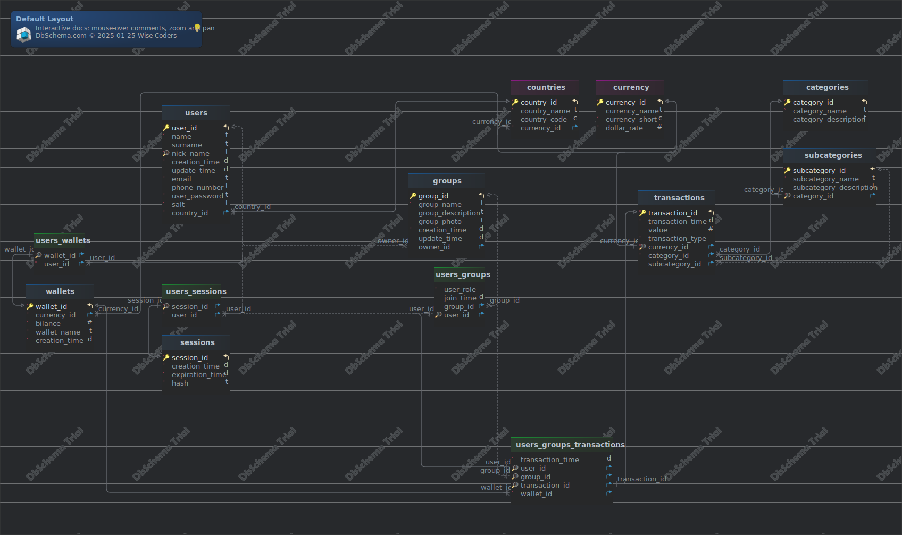

# Projekt bazy danych dla aplikacji do zarządzania budżetem domowym

- [Projekt bazy danych dla aplikacji do zarządzania budżetem domowym](#projekt-bazy-danych-dla-aplikacji-do-zarządzania-budżetem-domowym)
  - [Narzędzia użyte do wykonania projektu](#narzędzia-użyte-do-wykonania-projektu)
  - [Analiza wstępna wymagań](#analiza-wstępna-wymagań)
    - [Cel](#cel)
    - [Zakres](#zakres)
    - [Wymagania funkcjonalne](#wymagania-funkcjonalne)
      - [Użytkownicy](#użytkownicy)
      - [Portfele](#portfele)
      - [Grupy](#grupy)
      - [Tranzakcje](#tranzakcje)
      - [Kategorie](#kategorie)
      - [Raporty](#raporty)
    - [Wymagania niefunkcjonalne](#wymagania-niefunkcjonalne)
      - [Bezpieczeństwo](#bezpieczeństwo)
      - [Zgodność](#zgodność)
      - [Wydajność](#wydajność)
      - [Implementacja](#implementacja)
  - [Model ERD](#model-erd)
  - [Tabele](#tabele)
    - [Tabela categories](#tabela-categories)
        - [Indexes](#indexes)
    - [Tabela countries](#tabela-countries)
        - [Indexes](#indexes-1)
        - [Foreign Keys](#foreign-keys)
    - [Tabela currency](#tabela-currency)
        - [Indexes](#indexes-2)
    - [Tabela groups](#tabela-groups)
        - [Indexes](#indexes-3)
        - [Foreign Keys](#foreign-keys-1)
        - [Triggers](#triggers)
    - [Trigger group\_update\_time\_trigger](#trigger-group_update_time_trigger)
    - [Tabela sessions](#tabela-sessions)
        - [Indexes](#indexes-4)
    - [Tabela subcategories](#tabela-subcategories)
        - [Indexes](#indexes-5)
        - [Foreign Keys](#foreign-keys-2)
    - [Tabela transactions](#tabela-transactions)
        - [Indexes](#indexes-6)
        - [Foreign Keys](#foreign-keys-3)
    - [Tabela users](#tabela-users)
        - [Indexes](#indexes-7)
        - [Foreign Keys](#foreign-keys-4)
        - [Triggers](#triggers-1)
    - [Trigger user\_update\_time\_trigger](#trigger-user_update_time_trigger)
    - [Tabela users\_groups](#tabela-users_groups)
        - [Indexes](#indexes-8)
        - [Foreign Keys](#foreign-keys-5)
    - [Tabela users\_groups\_transactions](#tabela-users_groups_transactions)
        - [Indexes](#indexes-9)
        - [Foreign Keys](#foreign-keys-6)
        - [Triggers](#triggers-2)
    - [Trigger update\_wallet\_balance\_trigger](#trigger-update_wallet_balance_trigger)
    - [Tabela users\_sessions](#tabela-users_sessions)
        - [Indexes](#indexes-10)
        - [Foreign Keys](#foreign-keys-7)
    - [Tabela users\_wallets](#tabela-users_wallets)
        - [Indexes](#indexes-11)
        - [Foreign Keys](#foreign-keys-8)
    - [Tabela wallets](#tabela-wallets)
        - [Indexes](#indexes-12)
        - [Foreign Keys](#foreign-keys-9)
  - [Implementacja](#implementacja-1)
    - [Schemat](#schemat)
    - [Typy danych](#typy-danych)
      - [User\_role\_in\_group](#user_role_in_group)
      - [Transaction\_type](#transaction_type)
    - [Tabele](#tabele-1)
      - [Categories](#categories)
      - [Subcategories](#subcategories)
      - [Currency](#currency)
      - [Countries](#countries)
      - [Users](#users)
      - [Wallets](#wallets)
      - [Users Wallets](#users-wallets)
      - [Sessions](#sessions)
      - [Users sessions](#users-sessions)
      - [Groups](#groups)
      - [Users groups](#users-groups)
      - [Transactions](#transactions)
      - [Users groups transactions](#users-groups-transactions)
    - [Funkcje](#funkcje)
      - [Użytkowe](#użytkowe)
        - [Calc currency](#calc-currency)
      - [Triggery](#triggery)
        - [update group update time](#update-group-update-time)
        - [update user update time](#update-user-update-time)
        - [Update wallet balance](#update-wallet-balance)
      - [API](#api)
        - [add currency](#add-currency)
        - [add country](#add-country)
        - [add category](#add-category)
        - [add subcategory](#add-subcategory)
        - [create user](#create-user)
        - [login user](#login-user)
        - [verify session](#verify-session)
        - [create wallet](#create-wallet)
        - [join group](#join-group)
        - [create group](#create-group)
        - [change user role in group](#change-user-role-in-group)
        - [make transaction](#make-transaction)

## Narzędzia użyte do wykonania projektu

- [PostgreSQL](https://www.postgresql.org/) - jako silnik bazy danych
- [Docker](https://www.docker.com/) - narzędzie do konteneryzacji użyte do uruchomienia bazy danych PostgreSQL bez potrzeby pobierania oraz instalowania
- [DBSchema](https://dbschema.com/2023/07/11/sqlserver/user-defined-functions/) - narzędzie do stworzenia diagramu ERD

## Analiza wstępna wymagań

### Cel

Aplikacja ma na celu zarządzanie budżetem domowym użytkowników poprzez rejestrowanie przychodów oraz wydatków, analizy przepływów majątku oraz sporządzaniem podsumowań oraz raportów

### Zakres

Baza danych będzie obsługiwać użytkowników, ich portfele, grupy, kategorie wydatków oraz raporty finansowe

### Wymagania funkcjonalne

Funkcjonalność aplikacji została podzielona na poniższe moduły:

#### Użytkownicy

- Rejestrowania użytkownika
- Logowanie użytkownika oraz przechowywanie aktywnych sesji
- Przechowywanie danych użytkownika, takich jak:
  - email;
  - imię i nazwisko;
  - unikalny nick;
  - zaszyfrowane hasło
  - obywatelstwo;
- Obsługa wielu użytkowników z separacją ich danych

#### Portfele

- Możliwość tworzenia wielu portfeli przez użytkowników
- Portfele mogą być tworzone w różnych walutach
- Do portfeli możemy wpłacać oraz z nich wypłacać pieniądze

#### Grupy

- Grupa może zawierać wielu użytkowników
- Każda grupa posiada:
  - nazwę;
  - opis (opcjonalne);
  - zdjęcie (opcjonalne);
- Użytkownicy mogą tworzyć oraz dołączać do grup
- Użytkownicy w grupach podzieleni są na role:
  - administator;
  - guest;

#### Tranzakcje

- Rejestrowanie przychodów i wydatków
- Uwzględnienie użytkownika, grupy oraz portfela
- Kwalifikowanie tranzakcji względem kategorii oraz podkategorii (opcjonalne)
- Tylko portfele z wystarczającymi środkami mogą wykonać określoną transakcje

#### Kategorie

- Tworzenie własnych kategorii i podkategorii
- Podsumowania tworzone uwzględniając kategorie
- Użycie kategorii w transakcjach

#### Raporty

- Korzystanie z tej bazy danych ułatwi analizę danych oraz uprości pracę programistą w celu przygotowania raportów dla użytkowników lub grup

### Wymagania niefunkcjonalne

#### Bezpieczeństwo

- Zapis *Posolonych* haseł
- Ograniczony dostęp do danych użytkownika - każdy użytkownik widzi tylko swoje dane
- Tylko administratorzy mają możliwość dodawania, zmiany uprawnień oraz usuwania użytkowników z grupy

#### Zgodność
- Zgodność z systemem `PostreSQL`

#### Wydajność
- Czas odpowiedzi na zapytania nie powinien przekraczać 1 sekundy dla typowych operacji

#### Implementacja

- Implementacja z bazą za pomocą utworzonych gotowych funkcji

## Model ERD



## Tabele


### Tabela categories 
|Idx |Name |Data Type |
|---|---|---|
| * &#128273;  &#11019; | category\_id| integer GENERATED  BY DEFAULT AS IDENTITY |
| * | category\_name| varchar(100)  |
|  | category\_description| varchar(1000)  |


##### Indexes 
|Type |Name |On |
|---|---|---|
| &#128273;  | pk\_categories | ON category\_id|


### Tabela countries 
|Idx |Name |Data Type |Description |
|---|---|---|---|
| * &#128273;  &#11019; | country\_id| integer GENERATED  BY DEFAULT AS IDENTITY |  |
|  | country\_name| varchar(200)  |  |
| * &#128269; | country\_code| char(5) UNIQUE | Short name of country |
| * &#11016; | currency\_id| integer  |  |


##### Indexes 
|Type |Name |On |
|---|---|---|
| &#128273;  | pk\_countries | ON country\_id|
| &#128269;  | countries\_country\_code\_key | ON country\_code|

##### Foreign Keys
|Type |Name |On |
|---|---|---|
|  | fk_countries_currency | ( currency\_id ) ref [currency](#currency) (currency\_id) |


### Tabela currency 
|Idx |Name |Data Type |Description |
|---|---|---|---|
| * &#128273;  &#11019; | currency\_id| integer GENERATED  BY DEFAULT AS IDENTITY |  |
|  | currency\_name| varchar(100)  |  |
| * &#128269; | currency\_short| char(3) UNIQUE | Short name of currenty, for example USD for Dollar |
| * | dollar\_rate| numeric(100,4)  | Used for currency calculation. |


##### Indexes 
|Type |Name |On |
|---|---|---|
| &#128273;  | pk\_currency | ON currency\_id|
| &#128269;  | currency\_currency\_short\_key | ON currency\_short|


### Tabela groups 
|Idx |Name |Data Type |Description |
|---|---|---|---|
| * &#128273;  &#11019; | group\_id| integer GENERATED  BY DEFAULT AS IDENTITY |  |
| * | group\_name| varchar  DEFAULT 'New Group'::character varying |  |
|  | group\_description| varchar(1000)  |  |
|  | group\_photo| varchar(1000)  | Url to photo of group |
| * | creation\_time| timestamp  DEFAULT CURRENT_TIMESTAMP |  |
|  | update\_time| timestamp  |  |
| &#11016; | owner\_id| integer  | Id of user who created group |


##### Indexes 
|Type |Name |On |
|---|---|---|
| &#128273;  | pk\_groups | ON group\_id|

##### Foreign Keys
|Type |Name |On |
|---|---|---|
|  | fk_groups_users | ( owner\_id ) ref [users](#users) (user\_id) |


##### Triggers
|Name |Definition |
|---|---|
### Trigger group_update_time_trigger 
  
 ```
CREATE TRIGGER group\_update\_time\_trigger BEFORE UPDATE ON "home budget application".groups FOR EACH ROW EXECUTE FUNCTION "home budget application".update\_group\_update\_time()
``` 


### Tabela sessions 
|Idx |Name |Data Type |Description |
|---|---|---|---|
| * &#128273;  &#11019; | session\_id| integer GENERATED  BY DEFAULT AS IDENTITY |  |
| * | creation\_time| timestamp  DEFAULT CURRENT_TIMESTAMP |  |
| * | expiration\_time| timestamp  DEFAULT (CURRENT_TIMESTAMP + '24:00:00'::interval) |  |
| * | hash| text  DEFAULT md5(((random())::text || (clock_timestamp())::text)) | Value used to verify session on user side |


##### Indexes 
|Type |Name |On |
|---|---|---|
| &#128273;  | pk\_sessions | ON session\_id|


### Tabela subcategories 
|Idx |Name |Data Type |
|---|---|---|
| * &#128273;  &#11019; | subcategory\_id| integer GENERATED  BY DEFAULT AS IDENTITY |
| * | subcategory\_name| varchar(100)  |
|  | subcategory\_description| varchar(1000)  |
| * &#128269; &#11016; | category\_id| integer  |


##### Indexes 
|Type |Name |On |
|---|---|---|
| &#128273;  | pk\_subcategories | ON subcategory\_id|
| &#128269;  | unq\_subcategories\_category\_id | ON category\_id|

##### Foreign Keys
|Type |Name |On |
|---|---|---|
|  | fk_subcategories_categories | ( category\_id ) ref [categories](#categories) (category\_id) |


### Tabela transactions 
|Idx |Name |Data Type |Description |
|---|---|---|---|
| * &#128273;  &#11019; | transaction\_id| integer GENERATED  BY DEFAULT AS IDENTITY |  |
| * | transaction\_time| timestamp  DEFAULT CURRENT_TIMESTAMP |  |
|  | value| numeric(10,2)  |  |
| * | transaction\_type| "home budget application".home  | Enum type  with two options: 'deposit' and 'withdraw' |
| * &#128269; &#11016; | currency\_id| integer  |  |
| * &#11016; | category\_id| integer  |  |
| &#11016; | subcategory\_id| integer  |  |


##### Indexes 
|Type |Name |On |
|---|---|---|
| &#128273;  | pk\_transactions | ON transaction\_id|
| &#128269;  | unq\_transactions\_currency\_id | ON currency\_id|

##### Foreign Keys
|Type |Name |On |
|---|---|---|
|  | fk_transactions_currency | ( currency\_id ) ref [currency](#currency) (currency\_id) |
|  | fk_transactions_subcategories | ( subcategory\_id ) ref [subcategories](#subcategories) (subcategory\_id) |
|  | fk_transactions_categories | ( category\_id ) ref [categories](#categories) (category\_id) |


### Tabela users 
Users of the application

|Idx |Name |Data Type |Description |
|---|---|---|---|
| * &#128273;  &#11019; | user\_id| integer GENERATED  BY DEFAULT AS IDENTITY |  |
| * | name| varchar(100)  |  |
|  | surname| varchar(100)  |  |
| * &#128269; | nick\_name| varchar(100)  |  |
| * | creation\_time| timestamp  DEFAULT CURRENT_TIMESTAMP | Timestamp of user creation |
|  | update\_time| timestamp  | Timestamp of user data update |
| * | email| varchar(100) unique |  |
|  | phone\_number| varchar(15)  |  |
| * | user\_password| varchar(100)  |  |
| * | salt| varchar(100)  |  |
| * &#11016; | country\_id| integer  |  |


##### Indexes 
|Type |Name |On |
|---|---|---|
| &#128273;  | pk\_users | ON user\_id|
| &#128269;  | unq\_users\_nick\_name | ON nick\_name|

##### Foreign Keys
|Type |Name |On |
|---|---|---|
|  | fk_users_countries | ( country\_id ) ref [countries](#countries) (country\_id) |


##### Triggers
|Name |Definition |
|---|---|
### Trigger user_update_time_trigger 
  
 ```
CREATE TRIGGER user\_update\_time\_trigger BEFORE UPDATE ON "home budget application".users FOR EACH ROW EXECUTE FUNCTION "home budget application".update\_user\_update\_time()
``` 


### Tabela users_groups 
|Idx |Name |Data Type |Description |
|---|---|---|---|
| * | user\_role| "home budget application".home  DEFAULT 'guest'::"home budget application".user_role_in_group | Enum type with values:\- 'admin'\- 'guest' (default) |
|  | join\_time| timestamp  DEFAULT CURRENT_TIMESTAMP |  |
| &#11016; | group\_id| integer  |  |
| &#128269; &#11016; | user\_id| integer  |  |


##### Indexes 
|Type |Name |On |
|---|---|---|
| &#128269;  | unq\_users\_groups\_user\_id | ON user\_id|

##### Foreign Keys
|Type |Name |On |
|---|---|---|
|  | fk_users_groups_users | ( group\_id ) ref [groups](#groups) (group\_id) |
|  | fk_users_groups_users_0 | ( user\_id ) ref [users](#users) (user\_id) |


### Tabela users_groups_transactions 
|Idx |Name |Data Type |
|---|---|---|
| * | transaction\_time| timestamp  DEFAULT CURRENT_TIMESTAMP |
| * &#128269; &#11016; | user\_id| integer  |
| &#128269; &#11016; | group\_id| integer  |
| * &#128269; &#11016; | transaction\_id| integer  |
| * &#11016; | wallet\_id| integer  |


##### Indexes 
|Type |Name |On |
|---|---|---|
| &#128269;  | unq\_users\_groups\_transactions\_user\_id | ON user\_id|
| &#128269;  | unq\_users\_groups\_transactions\_group\_id | ON group\_id|
| &#128269;  | unq\_users\_groups\_transactions\_transaction\_id | ON transaction\_id|

##### Foreign Keys
|Type |Name |On |
|---|---|---|
|  | fk_users_groups_transactions_transactions | ( transaction\_id ) ref [transactions](#transactions) (transaction\_id) |
|  | fk_users_groups_transactions_groups | ( group\_id ) ref [groups](#groups) (group\_id) |
|  | fk_users_groups_transactions_users | ( user\_id ) ref [users](#users) (user\_id) |
|  | fk_users_groups_transactions_wallets | ( wallet\_id ) ref [wallets](#wallets) (wallet\_id) |


##### Triggers
|Name |Definition |
|---|---|
### Trigger update_wallet_balance_trigger 
  
 ```
CREATE TRIGGER update\_wallet\_balance\_trigger AFTER INSERT ON "home budget application".users\_groups\_transactions FOR EACH ROW EXECUTE FUNCTION "home budget application".update\_wallet\_balance()
``` 


### Tabela users_sessions 
|Idx |Name |Data Type |
|---|---|---|
| * &#128269; &#11016; | session\_id| integer  |
| * &#11016; | user\_id| integer  |


##### Indexes 
|Type |Name |On |
|---|---|---|
| &#128269;  | unq\_users\_sessions\_session\_id | ON session\_id|

##### Foreign Keys
|Type |Name |On |
|---|---|---|
|  | fk_users_sessions_users | ( user\_id ) ref [users](#users) (user\_id) |
|  | fk_users_sessions_sessions | ( session\_id ) ref [sessions](#sessions) (session\_id) |


### Tabela users_wallets 
|Idx |Name |Data Type |
|---|---|---|
| * &#128269; &#11016; | wallet\_id| integer  |
| * &#11016; | user\_id| integer  |


##### Indexes 
|Type |Name |On |
|---|---|---|
| &#128269;  | unq\_users\_walets\_wallet\_id | ON wallet\_id|

##### Foreign Keys
|Type |Name |On |
|---|---|---|
|  | fk_users_walets_users | ( user\_id ) ref [users](#users) (user\_id) |
|  | fk_users_wallets_wallets | ( wallet\_id ) ref [wallets](#wallets) (wallet\_id) |


### Tabela wallets 
|Idx |Name |Data Type |Description |
|---|---|---|---|
| * &#128273;  &#11019; | wallet\_id| integer GENERATED  BY DEFAULT AS IDENTITY |  |
| * &#11016; | currency\_id| integer  | Currency used for this wallet |
| * | bilance| money  DEFAULT 0 |  |
| * | wallet\_name| varchar(100)  |  |
| * | creation\_time| timestamp  DEFAULT CURRENT_TIMESTAMP |  |


##### Indexes 
|Type |Name |On |
|---|---|---|
| &#128273;  | pk\_wallets | ON wallet\_id|

##### Foreign Keys
|Type |Name |On |
|---|---|---|
|  | fk_wallets_currency | ( currency\_id ) ref [currency](#currency) (currency\_id) |


## Implementacja

### Schemat

```sql
-- Create Schema
CREATE SCHEMA IF NOT EXISTS "home budget application"
```

### Typy danych

#### User_role_in_group

```sql
CREATE TYPE "home budget application".user_role_in_group AS
enum ( 'admin', 'guest' )
```

#### Transaction_type

```sql
CREATE TYPE "home budget application".transaction_type AS
enum ( 'deposit', 'withdraw' )
```

### Tabele

#### Categories

```sql
CREATE  TABLE "home budget application".categories ( 
	category_id          integer  NOT NULL GENERATED BY DEFAULT AS IDENTITY  ,
	category_name        varchar(100)  NOT NULL  ,
	category_description varchar(1000)    ,
	CONSTRAINT pk_categories PRIMARY KEY ( category_id )
 ) 
```

#### Subcategories

```sql
CREATE  TABLE "home budget application".subcategories ( 
	subcategory_id       integer  NOT NULL GENERATED BY DEFAULT AS IDENTITY   ,
	subcategory_name     varchar(100)  NOT NULL  ,
	subcategory_description varchar(1000)    ,
	category_id          integer  NOT NULL  ,
	CONSTRAINT pk_subcategories PRIMARY KEY ( subcategory_id ),
	CONSTRAINT unq_subcategories_category_id UNIQUE ( category_id ) 
 ) 
```

#### Currency

```sql
CREATE  TABLE "home budget application".currency ( 
	currency_id          integer  NOT NULL GENERATED BY DEFAULT AS IDENTITY   ,
	currency_name        varchar(100)    ,
	currency_short       char(3)  NOT NULL  ,
	dollar_rate          numeric(100,4)  NOT NULL  ,
	CONSTRAINT pk_currency PRIMARY KEY ( currency_id )
 )

```

#### Countries

```sql
 CREATE  TABLE "home budget application".countries ( 
	country_id           integer  NOT NULL GENERATED BY DEFAULT AS IDENTITY   ,
	country_name         varchar(200)  NOT NULL  ,
	country_code         char(5)    ,
	currency_id          integer  NOT NULL  ,
	CONSTRAINT pk_countries PRIMARY KEY ( country_id )
 ) 

```

#### Users

```sql
 CREATE  TABLE "home budget application".users ( 
	user_id              integer  NOT NULL GENERATED BY DEFAULT AS IDENTITY   ,
	name                 varchar(100)  NOT NULL  ,
	surname              varchar(100)    ,
	nick_name            varchar(100)  NOT NULL  ,
	creation_time        timestamp DEFAULT CURRENT_TIMESTAMP NOT NULL  ,
	update_time          timestamp    ,
	email                varchar(100)  NOT NULL  ,
	phone_number         varchar(15)    ,
	user_password        varchar(100)  NOT NULL  ,
	salt                 varchar(100)  NOT NULL  ,
	country_id           integer  NOT NULL  ,
	CONSTRAINT pk_users PRIMARY KEY ( user_id )
 ) 

 CREATE UNIQUE INDEX unq_users_nick_name ON "home budget application".users ( nick_name )
```

#### Wallets

```sql
 CREATE  TABLE "home budget application".wallets ( 
	wallet_id            integer  NOT NULL GENERATED BY DEFAULT AS IDENTITY   ,
	currency_id          integer  NOT NULL  ,
	bilance              money DEFAULT 0 NOT NULL  ,
	wallet_name          varchar(100)  NOT NULL  ,
	creation_time        timestamp DEFAULT CURRENT_TIMESTAMP NOT NULL  ,
	CONSTRAINT pk_wallets PRIMARY KEY ( wallet_id )
 ) 
```

#### Users Wallets

```sql
 CREATE  TABLE "home budget application".users_wallets ( 
	wallet_id            integer  NOT NULL  ,
	user_id              integer  NOT NULL  ,
	CONSTRAINT unq_users_walets_wallet_id UNIQUE ( wallet_id ) 
 ) 
```

#### Sessions

```sql
CREATE  TABLE "home budget application".sessions ( 
	session_id           integer  NOT NULL GENERATED BY DEFAULT AS IDENTITY   ,
	creation_time        timestamp DEFAULT CURRENT_TIMESTAMP NOT NULL  ,
	expiration_time      timestamp DEFAULT CURRENT_TIMESTAMP + INTERVAL '86400 seconds' NOT NULL  ,
	hash                 text DEFAULT md5(random()::text || clock_timestamp()::text) NOT NULL  ,
	CONSTRAINT pk_sessions PRIMARY KEY ( session_id )
 )
```

#### Users sessions

```sql
CREATE  TABLE "home budget application".users_sessions ( 
	session_id           integer  NOT NULL  ,
	user_id              integer  NOT NULL  ,
	CONSTRAINT unq_users_sessions_session_id UNIQUE ( session_id ) 
 ) 
```

#### Groups

```sql
CREATE  TABLE "home budget application".groups ( 
	group_id             integer  NOT NULL GENERATED BY DEFAULT AS IDENTITY   ,
	group_name           varchar(100) DEFAULT 'New Group' NOT NULL  ,
	group_description    varchar(1000)    ,
	group_photo          varchar(1000)    ,
	creation_time        timestamp DEFAULT CURRENT_TIMESTAMP NOT NULL  ,
	update_time          timestamp    ,
	owner_id             integer    ,
	CONSTRAINT pk_groups PRIMARY KEY ( group_id )
 ) 
```

#### Users groups

```sql
 CREATE  TABLE "home budget application".users_groups ( 
	user_role            "home budget application".user_role_in_group  NOT NULL DEFAULT 'guest'  ,
	join_time            timestamp DEFAULT CURRENT_TIMESTAMP   ,
	group_id             integer    ,
	user_id              integer    ,
	CONSTRAINT unq_users_groups_user_id UNIQUE ( user_id ) 
 ) 
```

#### Transactions

```sql
 CREATE  TABLE "home budget application".transactions ( 
	transaction_id       integer  NOT NULL GENERATED BY DEFAULT AS IDENTITY  ,
	transaction_time     timestamp DEFAULT CURRENT_TIMESTAMP NOT NULL  ,
	"value"              numeric(10,2)    ,
	transaction_type     "home budget application".transaction_type  NOT NULL  ,
	currency_id          integer  NOT NULL  ,
	category_id          integer  NOT NULL  ,
	subcategory_id       integer    ,
	CONSTRAINT pk_transactions PRIMARY KEY ( transaction_id ),
	CONSTRAINT unq_transactions_currency_id UNIQUE ( currency_id ) 
 ) 
```

#### Users groups transactions

```sql
 CREATE  TABLE "home budget application".users_groups_transactions ( 
	transaction_time     timestamp DEFAULT CURRENT_TIMESTAMP NOT NULL  ,
	user_id              integer  NOT NULL  ,
	group_id             integer    ,
	transaction_id       integer  NOT NULL  ,
	wallet_id            integer  NOT NULL  ,
	CONSTRAINT unq_users_groups_transactions_user_id UNIQUE ( user_id ) ,
	CONSTRAINT unq_users_groups_transactions_group_id UNIQUE ( group_id ) ,
	CONSTRAINT unq_users_groups_transactions_transaction_id UNIQUE ( transaction_id ) 
 ) 
```

### Funkcje

#### Użytkowe

##### Calc currency

```sql
CREATE OR REPLACE FUNCTION "home budget application".calc_currency(
    input_dollar_rate numeric,
    output_dollar_rate numeric,
    input_value numeric
)
RETURNS INTEGER
LANGUAGE plpgsql
AS $function$
BEGIN
    RETURN input_value * input_dollar_rate / output_dollar_rate;
END;
$function$
;
```

**Cel**: Ta funkcja przelicza wartość waluty na podstawie kursu dolara. 

Parametry:

- `input_dollar_rate`: Kurs wymiany waluty wejściowej w dolarach.
- `output_dollar_rate`: Kurs wymiany waluty wyjściowej w dolarach.
- `input_value`: Wartość w walucie wejściowej do przeliczenia.
  
**Zwraca**: Równowartość w walucie wyjściowej.

#### Triggery

##### update group update time

```sql
CREATE OR REPLACE FUNCTION "home budget application".update_group_update_time()
 RETURNS trigger
 LANGUAGE plpgsql
AS $function$
BEGIN
    NEW.update_time = CURRENT_TIMESTAMP;
    RETURN NEW;
END;
$function$
;
```

**Cel**: Ta funkcja triggera automatycznie aktualizuje pole update_time na bieżący znacznik czasu, gdy rząd w tabeli groups jest aktualizowany. 

**Parametry**: Brak. 

**Zwraca**: Zaktualizowany rząd z bieżącym znacznikiem czasu.


##### update user update time

```sql
CREATE OR REPLACE FUNCTION "home budget application".update_user_update_time()
 RETURNS trigger
 LANGUAGE plpgsql
AS $function$
BEGIN
    NEW.update_time = CURRENT_TIMESTAMP;
    RETURN NEW;
END;
$function$
;
```

**Cel**: Ta funkcja triggera automatycznie aktualizuje pole update_time na bieżący znacznik czasu, gdy rząd w tabeli users jest aktualizowany. 

**Parametry**: Brak. 

**Zwraca**: Zaktualizowany rząd z bieżącym znacznikiem czasu.

##### Update wallet balance

```sql
CREATE OR REPLACE FUNCTION "home budget application".update_wallet_balance()
RETURNS TRIGGER AS $$
DECLARE
    v_transaction "home budget application".transactions%ROWTYPE;
    v_wallet "home budget application".wallets%ROWTYPE;

    v_in_dollar_rate numeric;
    v_out_dollar_rate numeric;
    v_calc_value numeric;
BEGIN
    SELECT * INTO v_transaction
    FROM "home budget application".transactions
    WHERE transaction_id = NEW.transaction_id;

    IF v_transaction.transaction_id IS NULL THEN
        RAISE EXCEPTION 'Transaction with id % does not exist', NEW.transaction_id;
        RETURN OLD;
    END IF;

    SELECT * INTO v_wallet
    FROM "home budget application".wallets
    WHERE wallet_id = NEW.wallet_id;

    IF v_wallet.wallet_id IS NULL THEN
        RAISE EXCEPTION 'Wallet with id % does not exist', NEW.wallet_id;
        RETURN OLD;
    END IF;

    -- Get dollar rate from transaction currency
    SELECT dollar_rate INTO v_in_dollar_rate
    FROM "home budget application".currency
    WHERE currency_id = v_transaction.currency_id;

    -- Get dollar rate of wallet currency
    SELECT dollar_rate INTO v_out_dollar_rate
    FROM "home budget application".currency
    WHERE currency_id = v_wallet.currency_id;

    -- Calculate the transaction value in the wallet currency
    v_calc_value := "home budget application".calc_currency(
        v_in_dollar_rate, v_out_dollar_rate, v_transaction.value
    );

    -- Update the wallet balance based on transaction type
    IF v_transaction.transaction_type = 'withdraw'::"home budget application".transaction_type THEN
        UPDATE "home budget application".wallets
        SET balance = balance - v_calc_value
        WHERE wallet_id = NEW.wallet_id;
    ELSIF v_transaction.transaction_type = 'deposit'::"home budget application".transaction_type THEN
        UPDATE "home budget application".wallets
        SET balance = balance + v_calc_value
        WHERE wallet_id = NEW.wallet_id;
    END IF;

    RETURN NEW;
END;
$$ LANGUAGE plpgsql;
```
**Cel**: Ta funkcja triggera aktualizuje bilans portfela na podstawie nowych transakcji. Obsługuje zarówno transakcje typu withdraw, jak i deposit. 

**Parametry**: Brak. 

**Zwraca**: Nowy rząd w tabeli users_groups_transactions.

#### API

##### add currency

```sql
CREATE OR REPLACE FUNCTION "home budget application".add_currency(
    p_currency_name VARCHAR,
    p_currency_short CHAR(3),
    p_dollar_rate NUMERIC
) RETURNS "home budget application".currency AS $$
DECLARE
    v_currency "home budget application".currency%ROWTYPE;
BEGIN
    INSERT INTO "home budget application".currency (
        currency_name, currency_short, dollar_rate
    ) VALUES (
        p_currency_name, p_currency_short, p_dollar_rate
    ) RETURNING * INTO v_currency;
    
    RETURN v_currency;
END;
$$ LANGUAGE plpgsql;
```

**Cel**: Dodaje nową walutę do tabeli currency. 

**Parametry**:

- `p_currency_name`: Nazwa waluty.
- `p_currency_short`: Skrócona forma (kod) waluty.
- `p_dollar_rate`: Kurs wymiany waluty w dolarach.
  
**Zwraca**: Nowo wstawiony rząd z tabeli currency.

##### add country

```sql
CREATE OR REPLACE FUNCTION "home budget application".add_country(
    p_country_name character varying,
    p_country_code character,
    p_currency_short character
)
RETURNS "home budget application".countries
LANGUAGE plpgsql
AS $function$
DECLARE
    v_country "home budget application".countries%ROWTYPE;
    v_currency_id INTEGER;
BEGIN
    -- Check if the currency exists
    SELECT currency_id INTO v_currency_id
    FROM "home budget application".currency
    WHERE currency_short = p_currency_short;

    -- If the currency ID is null, raise an exception and do not insert the country
    IF v_currency_id IS NULL THEN
        RAISE EXCEPTION 'Currency with short code % does not exist', p_currency_short;
        RETURN NULL;
    END IF;

    -- Insert the country if the currency exists
    INSERT INTO "home budget application".countries (
        country_name, country_code, currency_id
    ) VALUES (
        p_country_name, p_country_code, v_currency_id
    ) RETURNING * INTO v_country;
    
    RETURN v_country;
END;
$function$
;
```

**Cel**: Dodaje nowy kraj do tabeli countries. 

**Parametry**:

- `p_country_name`: Nazwa kraju.
- `p_country_code`: Kod kraju.
- `p_currency_short`: Kod skrótu waluty używanej w kraju. 

**Zwraca**: Nowo wstawiony rząd z tabeli countries.

##### add category

```sql
CREATE OR REPLACE FUNCTION "home budget application".add_category(
    p_category_name character varying,
    p_category_description character varying
)
RETURNS "home budget application".categories
LANGUAGE plpgsql
AS $function$
DECLARE
    v_category "home budget application".categories%ROWTYPE;
BEGIN
    -- Insert the category
    INSERT INTO "home budget application".categories (
        category_name, category_description
    ) VALUES (
        p_category_name, p_category_description
    ) RETURNING * INTO v_category;
    
    RETURN v_category;
END;
$function$
;
```
**Cel**: Dodaje nową kategorię do tabeli categories.

**Parametry**:

- `p_category_name`: Nazwa kategorii.
- `p_category_description`: Opis kategorii. 
  
**Zwraca**: Nowo wstawiony rząd z tabeli categories.

##### add subcategory

```sql
CREATE OR REPLACE FUNCTION "home budget application".add_subcategory(
    p_subcategory_name character varying,
    p_subcategory_description character varying,
    p_category_name character varying
)
RETURNS "home budget application".subcategories
LANGUAGE plpgsql
AS $function$
DECLARE
    v_subcategory "home budget application".subcategories%ROWTYPE;
    v_category_id INTEGER;
BEGIN
    -- Check if the category exists
    SELECT category_id INTO v_category_id
    FROM "home budget application".categories
    WHERE category_name = p_category_name;

    -- If the category ID is null, raise an exception and do not insert the subcategory
    IF v_category_id IS NULL THEN
        RAISE EXCEPTION 'Category with name % does not exist', p_category_name;
        RETURN NULL;
    END IF;

    -- Insert the subcategory if the category exists
    INSERT INTO "home budget application".subcategories (
        subcategory_name, subcategory_description, category_id
    ) VALUES (
        p_subcategory_name, p_subcategory_description, v_category_id
    ) RETURNING * INTO v_subcategory;
    
    RETURN v_subcategory;
END;
$function$
;
```

**Cel**: Dodaje nową podkategorię do tabeli subcategories. 

**Parametry**:
- `p_subcategory_name`: Nazwa podkategorii.
- `p_subcategory_description`: Opis podkategorii.
- `p_category_name`: Nazwa nadrzędnej kategorii.
  
**Zwraca**: Nowo wstawiony rząd z tabeli subcategories.

##### create user

```sql
CREATE OR REPLACE FUNCTION "home budget application".create_user(
    p_name VARCHAR,
    p_email VARCHAR,
    p_user_password VARCHAR,
    p_country_short CHAR(3),
    p_surname VARCHAR DEFAULT NULL,
    p_nick_name VARCHAR DEFAULT NULL,
    p_phone_number VARCHAR DEFAULT NULL   
)
RETURNS "home budget application".users
LANGUAGE plpgsql
AS $function$
DECLARE
    v_user "home budget application".users%ROWTYPE;
    v_salt VARCHAR := md5(random()::text || clock_timestamp()::text);
    v_hashed_password VARCHAR := md5(p_user_password || v_salt);
    v_country_id INTEGER;
    v_sequence INTEGER := 1;
    v_new_nick_name VARCHAR;
BEGIN
    -- Check if email has correct syntax
    IF p_email !~ '^[A-Za-z0-9._%+-]+@[A-Za-z0-9.-]+\.[A-Za-z]{2,}$' THEN
        RAISE EXCEPTION 'Invalid email format: %', p_email;
        RETURN NULL;
    END IF;

    -- Lookup country_id based on country_short
    SELECT country_id INTO v_country_id
    FROM "home budget application".countries
    WHERE country_code = p_country_short;

    -- If country_id is null, raise an exception
    IF v_country_id IS NULL THEN
        RAISE EXCEPTION 'Country with short code % does not exist', p_country_short;
        RETURN NULL;
    END IF;

    -- Generate a unique nick_name if not provided
    IF p_nick_name IS NULL THEN
        v_new_nick_name := p_name || to_char(floor(random() * 9 + 1)::integer, 'FM0000');
        -- Check if the generated nick_name already exists
        WHILE EXISTS (SELECT 1 FROM "home budget application".users WHERE nick_name = v_new_nick_name) LOOP
            v_sequence := v_sequence + 1;
            v_new_nick_name := p_name || to_char(v_sequence, 'FM0000');
        END LOOP;
        p_nick_name := v_new_nick_name;
    ELSE
        -- Check if the provided nick_name already exists
        WHILE EXISTS (SELECT 1 FROM "home budget application".users WHERE nick_name = p_nick_name) LOOP
            v_sequence := v_sequence + 1;
            p_nick_name := p_nick_name || to_char(v_sequence, 'FM0000');
        END LOOP;
    END IF;

    -- Insert the new user
    INSERT INTO "home budget application".users (
        name, surname, nick_name, email, phone_number, user_password, salt, country_id
    ) VALUES (
        p_name, p_surname, p_nick_name, p_email, p_phone_number, v_hashed_password, v_salt, v_country_id
    ) RETURNING * INTO v_user;

    RETURN v_user;
END;
$function$
```

**Cel**: Tworzy nowego użytkownika w tabeli users.

**Parametry**:
- `p_name`: Imię użytkownika.
- `p_email`: Adres email użytkownika.
- `p_user_password`: Hasło użytkownika.
- `p_country_short`: Skrót kraju.
- `p_surname`: Nazwisko użytkownika (opcjonalne).
- `p_nick_name`: Nazwa użytkownika (opcjonalne).
- `p_phone_number`: Numer telefonu użytkownika (opcjonalne).
  
**Zwraca**: Nowo wstawiony rząd z tabeli users.

##### login user

CREATE OR REPLACE FUNCTION "home budget application".login_user(
    p_email VARCHAR,
    p_user_password VARCHAR
)
RETURNS TEXT 
LANGUAGE plpgsql
AS $function$
DECLARE
    v_user "home budget application".users%ROWTYPE;
    v_session "home budget application".sessions%ROWTYPE;
BEGIN
    -- Retrieve user by email
    SELECT * INTO v_user
    FROM "home budget application".users
    WHERE email = p_email;

    -- Check if user exists and verify password
    IF v_user.user_id IS NULL THEN
        RAISE EXCEPTION 'User with email % does not exist', p_email;
        RETURN NULL;
    ELSIF v_user.user_password != md5(p_user_password || v_user.salt) THEN
        RAISE EXCEPTION 'Incorrect password for email %', p_email;
        RETURN NULL;
    END IF;

    -- Create a new session
    INSERT INTO "home budget application".sessions DEFAULT VALUES
    RETURNING * INTO v_session;

    -- Link the session with the user
    INSERT INTO "home budget application".users_sessions (
        session_id, user_id
    ) VALUES (
        v_session.session_id, v_user.user_id
    );

    -- Return the session hash
    RETURN v_session.hash;
END;
$function$
;

**Cel**: Funkcja logowania użytkownika, która sprawdza poprawność adresu e-mail i hasła, tworzy nową sesję, a następnie zwraca hash sesji.

**Parametry**:

- `p_email`: Adres e-mail użytkownika.
- `p_user_password`: Hasło użytkownika.
  
**Zwraca**: Hash sesji, jeśli logowanie jest poprawne.

##### verify session

```sql
CREATE OR REPLACE FUNCTION "home budget application".verify_session(
    p_session_hash TEXT
)
RETURNS INTEGER
LANGUAGE plpgsql
AS $function$
DECLARE
    v_session "home budget application".sessions%ROWTYPE;
    v_user_id INTEGER;
BEGIN
    -- Retrieve session by session hash
    SELECT * INTO v_session
    FROM "home budget application".sessions
    WHERE hash = p_session_hash;

    -- Check if session exists and is still valid
    IF v_session.session_id IS NULL THEN
        RETURN NULL;
    ELSIF v_session.expiration_time < CURRENT_TIMESTAMP THEN
        RETURN NULL;
    ELSE
        -- Retrieve user_id from users_sessions
        SELECT user_id INTO v_user_id
        FROM "home budget application".users_sessions
        WHERE session_id = v_session.session_id;

        RETURN v_user_id;
    END IF;
END;
$function$
;
```

**Cel**: Funkcja weryfikująca sesję użytkownika na podstawie hash sesji. Sprawdza, czy sesja istnieje i jest nadal ważna.

**Parametry**:
- `p_session_hash`: Hash sesji. Zwraca: ID użytkownika, jeśli sesja jest ważna, lub NULL, jeśli sesja wygasła lub nie istnieje.

##### create wallet

```sql
CREATE OR REPLACE FUNCTION "home budget application".create_wallet(
    p_session_hash TEXT,
    p_wallet_name VARCHAR,
    p_currency_short CHAR(3)
)
RETURNS "home budget application".wallets
LANGUAGE plpgsql
AS $function$
DECLARE
    v_user_id INTEGER;
    v_wallet "home budget application".wallets%ROWTYPE;
    v_currency_id INTEGER;
BEGIN
    -- Verify session and get user_id
    v_user_id := "home budget application".verify_session(p_session_hash);

    -- If user_id is null, raise an exception
    IF v_user_id IS NULL THEN
        RAISE EXCEPTION 'Invalid or expired session';
        RETURN NULL;
    END IF;

    -- Lookup currency_id based on currency_short
    SELECT currency_id INTO v_currency_id
    FROM "home budget application".currency
    WHERE currency_short = p_currency_short;

    -- If currency_id is null, raise an exception
    IF v_currency_id IS NULL THEN
        RAISE EXCEPTION 'Currency with short code % does not exist', p_currency_short;
        RETURN NULL;
    END IF;

    -- Create a new wallet
    INSERT INTO "home budget application".wallets (
        wallet_name, currency_id
    ) VALUES (
        p_wallet_name, v_currency_id
    ) RETURNING * INTO v_wallet;

    -- Link the wallet with the user
    INSERT INTO "home budget application".users_wallets (
        wallet_id, user_id
    ) VALUES (
        v_wallet.wallet_id, v_user_id
    );

    -- Return the wallet
    RETURN v_wallet;
END;
$function$
;
```

**Cel**: Funkcja tworząca nowy portfel użytkownika. Weryfikuje sesję, wyszukuje ID waluty i tworzy nowy portfel, a następnie przypisuje go do użytkownika.

**Parametry**:

- `p_session_hash`: Hash sesji użytkownika.
- `p_wallet_name`: Nazwa portfela.
- `p_currency_short`: Skrót waluty używanej w portfelu.
 
Zwraca: Nowo utworzony portfel z tabeli wallets.

##### join group

```sql
CREATE OR REPLACE FUNCTION "home budget application".join_group(
    p_session_hash TEXT,
    p_group_id integer,
    p_user_role VARCHAR
)
RETURNS "home budget application".users_groups
LANGUAGE plpgsql
AS $function$
DECLARE
    v_user_id INTEGER;
    v_group "home budget application".groups%ROWTYPE;
    v_users_groups "home budget application".users_groups%ROWTYPE;
BEGIN
    -- Verify session and get user_id
    v_user_id := "home budget application".verify_session(p_session_hash);

    -- If user_id is null, raise an exception
    IF v_user_id IS NULL THEN
        RAISE EXCEPTION 'Invalid or expired session';
        RETURN NULL;
    END IF;

    -- Check if group exists --
    SELECT * INTO v_group
    FROM "home budget application".groups
    WHERE group_id = p_group_id;

    IF v_group IS NULL THEN
        RAISE EXCEPTION 'Group with ID: % does not exist', p_group_id;
        RETURN NULL;
    END IF;

    INSERT INTO "home budget application".users_groups (
        user_role, group_id, user_id
    ) VALUES (
        p_user_role::"home budget application".user_role_in_group, p_group_id, v_user_id
    ) RETURNING * INTO v_users_groups;

    RETURN v_users_groups;
    
END;
$function$
;
```
**Cel**: Funkcja dołączania użytkownika do grupy. Weryfikuje sesję, sprawdza, czy grupa istnieje, a następnie dodaje użytkownika do grupy z określoną rolą.

**Parametry**:

- `p_session_hash`: Hash sesji użytkownika.
- `p_group_id`: ID grupy.
- `p_user_role`: Rola użytkownika w grupie.

**Zwraca**: Nowo dodany rząd z tabeli users_groups.

##### create group

```sql
CREATE OR REPLACE FUNCTION "home budget application".create_group(
    p_session_hash TEXT,
    p_group_name VARCHAR,
    p_group_description VARCHAR DEFAULT NULL,
    p_group_photo VARCHAR DEFAULT NULL
)
RETURNS "home budget application".groups
LANGUAGE plpgsql
AS $function$
DECLARE
    v_user_id INTEGER;
    v_group "home budget application".groups%ROWTYPE;
BEGIN
    -- Verify session and get user_id
    v_user_id := "home budget application".verify_session(p_session_hash);

    -- If user_id is null, raise an exception
    IF v_user_id IS NULL THEN
        RAISE EXCEPTION 'Invalid or expired session';
        RETURN NULL;
    END IF;

    -- Creates new group in table groups
    INSERT INTO "home budget application".groups (
        group_name, group_description, group_photo, owner_id
    ) VALUES (
        p_group_name, p_group_description, p_group_photo, v_user_id
    ) RETURNING * INTO v_group;

    -- Adds User to users_groups table with admin permissions
    PERFORM "home budget application".join_group(p_session_hash, v_group.group_id, 'admin');

    RETURN v_group;

END;
$function$
;
```

**Cel**: Funkcja tworząca nową grupę. Weryfikuje sesję użytkownika, tworzy nową grupę, a następnie dodaje użytkownika do grupy z rolą administratora. 

**Parametry**:

- `p_session_hash`: Hash sesji użytkownika.
- `p_group_name`: Nazwa grupy.
- `p_group_description`: Opis grupy (opcjonalne).
- `p_group_photo`: Zdjęcie grupy (opcjonalne).

**Zwraca**: Nowo utworzona grupa z tabeli groups.

##### change user role in group

```sql
CREATE OR REPLACE FUNCTION "home budget application".change_user_role_in_group(
    p_session_hash TEXT,
    p_email VARCHAR,
    p_group_id INTEGER,
    p_role VARCHAR
)
RETURNS "home budget application".users_groups
LANGUAGE plpgsql
AS $function$
DECLARE
    v_admin_user_id INTEGER;
    v_target_user_id INTEGER;
    v_users_groups "home budget application".users_groups%ROWTYPE;
BEGIN
    -- Verify session and get admin_user_id
    v_admin_user_id := "home budget application".verify_session(p_session_hash);

    -- If admin_user_id is null, raise an exception
    IF v_admin_user_id IS NULL THEN
        RAISE EXCEPTION 'Invalid or expired session';
        RETURN NULL;
    END IF;

    -- Check if admin user is in the group and has an admin role
    IF NOT EXISTS (
        SELECT 1
        FROM "home budget application".users_groups
        WHERE user_id = v_admin_user_id
        AND group_id = p_group_id
        AND user_role = 'admin'
    ) THEN
        RAISE EXCEPTION 'User does not have admin permissions in group %', p_group_id;
        RETURN NULL;
    END IF;

    -- Get the user ID of the target user
    SELECT user_id INTO v_target_user_id
    FROM "home budget application".users
    WHERE email = p_email;

    -- If target user does not exist, raise an exception
    IF v_target_user_id IS NULL THEN
        RAISE EXCEPTION 'User with email % does not exist', p_email;
        RETURN NULL;
    END IF;

    -- Check if the target user is in the specified group
    IF NOT EXISTS (
        SELECT 1
        FROM "home budget application".users_groups
        WHERE user_id = v_target_user_id
        AND group_id = p_group_id
    ) THEN
        RAISE EXCEPTION 'User with email % is not in group %', p_email, p_group_id;
        RETURN NULL;
    END IF;

    -- Update the user role in the group
    UPDATE "home budget application".users_groups
    SET user_role = p_role::"home budget application".user_role_in_group
    WHERE user_id = v_target_user_id
    AND group_id = p_group_id
    RETURNING * INTO v_users_groups;

    -- Return the updated users_groups row
    RETURN v_users_groups;
END;
$function$
;
```

**Cel**: Zmienia rolę użytkownika w grupie. Weryfikuje sesję administratora, sprawdza, czy użytkownik ma rolę administratora w grupie, a następnie zmienia rolę określonego użytkownika w grupie.

**Parametry**:

- `p_session_hash`: Hash sesji administratora.
- `p_email`: Adres email użytkownika, którego rola ma zostać zmieniona.
- `p_group_id`: ID grupy.
- `p_role`: Nowa rola użytkownika w grupie.
    
**Zwraca**: Zaktualizowany rząd z tabeli users_groups.

##### make transaction

```sql
CREATE OR REPLACE FUNCTION "home budget application".make_transaction(
    p_session_hash TEXT,
    p_wallet_id INTEGER,
    p_value NUMERIC,
    p_currency_short CHAR(3),
    p_transaction_type "home budget application".transaction_type,
    p_category_name VARCHAR,
    p_group_id INTEGER,
    p_subcategory_name VARCHAR DEFAULT NULL
) RETURNS "home budget application".transactions AS $function$
DECLARE
    v_user_id INTEGER;
    v_currency_id INTEGER;
    v_category_id INTEGER;
    v_subcategory_id INTEGER;
    v_transaction "home budget application".transactions%ROWTYPE;
    v_wallet "home budget application".wallets%ROWTYPE;

    v_in_dollar_rate NUMERIC;
    v_out_dollar_rate NUMERIC;
    v_calc_value NUMERIC;
BEGIN
    -- Verify session and get user_id
    v_user_id := "home budget application".verify_session(p_session_hash);

    -- If user_id is null, raise an exception
    IF v_user_id IS NULL THEN
        RAISE EXCEPTION 'Invalid or expired session';
        RETURN NULL;
    END IF;

    -- Retrieve the currency_id
    SELECT currency_id INTO v_currency_id
    FROM "home budget application".currency
    WHERE currency_short = p_currency_short;

    -- If currency_id is null, raise an exception
    IF v_currency_id IS NULL THEN
        RAISE EXCEPTION 'Currency with short code % does not exist', p_currency_short;
        RETURN NULL;
    END IF;

    -- Retrieve the category_id
    SELECT category_id INTO v_category_id
    FROM "home budget application".categories
    WHERE category_name = p_category_name;

    -- If v_category_id is null, raise an exception
    IF v_category_id IS NULL THEN
        RAISE EXCEPTION 'Category with name % does not exist', p_category_name;
        RETURN NULL;
    END IF;

    IF p_group_id IS NOT NULL THEN
        IF NOT EXISTS (
            SELECT 1
            FROM "home budget application".groups
            WHERE group_id = p_group_id
        ) THEN
            RAISE EXCEPTION 'Group with id % does not exist', p_group_id;
            RETURN NULL;
        END IF;
    END IF;

    -- Retrieve the subcategory_id (if provided)
    IF p_subcategory_name IS NOT NULL THEN
        SELECT subcategory_id INTO v_subcategory_id
        FROM "home budget application".subcategories
        WHERE subcategory_name = p_subcategory_name
        AND category_id = v_category_id;
    ELSE
        v_subcategory_id := NULL;
    END IF;

    -- Check if wallet exists and retrieve balance
    SELECT * INTO v_wallet
    FROM "home budget application".wallets
    WHERE wallet_id = p_wallet_id;

    IF v_wallet.wallet_id IS NULL THEN
        RAISE EXCEPTION 'Wallet with id % does not exist', p_wallet_id;
        RETURN NULL;
    END IF;

    -- Get dollar rates for currency conversion
    SELECT dollar_rate INTO v_in_dollar_rate
    FROM  "home budget application".currency
    WHERE currency_id = v_currency_id;

    SELECT dollar_rate INTO v_out_dollar_rate
    FROM  "home budget application".currency
    WHERE currency_id = v_wallet.currency_id;

    -- Calculate transaction value in wallet currency
    v_calc_value := "home budget application".calc_currency(v_in_dollar_rate, v_out_dollar_rate, p_value);

    -- Check if there are sufficient funds for a withdrawal
    IF p_transaction_type = 'withdraw' AND v_wallet.balance < v_calc_value THEN
        RAISE EXCEPTION 'Insufficient funds in wallet id %', p_wallet_id;
        RETURN NULL;
    END IF;

    -- Insert the transaction into the transactions table
    INSERT INTO "home budget application".transactions (
        value, currency_id, transaction_type, category_id, subcategory_id
    ) VALUES (
        p_value, v_currency_id, p_transaction_type, v_category_id, v_subcategory_id
    ) RETURNING * INTO v_transaction;

    -- Insert into users_groups_transactions
    INSERT INTO "home budget application".users_groups_transactions (
        user_id, wallet_id, transaction_id, group_id
    ) VALUES (
        v_user_id, p_wallet_id, v_transaction.transaction_id, p_group_id
    );

    RETURN v_transaction;
END;
$function$
LANGUAGE plpgsql;
```

**Cel**: Tworzenie transakcji, która sprawdza poprawność sesji użytkownika, pobiera odpowiednie ID waluty, kategorii i podkategorii, sprawdza dostępność środków w portfelu i tworzy transakcję oraz łączy ją z użytkownikiem i grupą, jeśli istnieje.

**Parametry**:

- `p_session_hash`: Hash sesji użytkownika.
- `p_wallet_id`: ID portfela.
- `p_value`: Wartość transakcji.
- `p_currency_short`: Kod waluty.
- `p_transaction_type`: Typ transakcji ("withdraw" lub "deposit").
- `p_category_name`: Nazwa kategorii.
- `p_group_id`: ID grupy.
- `p_subcategory_name`: Nazwa podkategorii (opcjonalne).

**Zwraca**: Nowo utworzona transakcja z tabeli transactions.